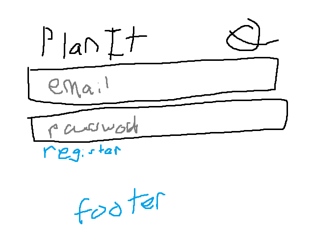
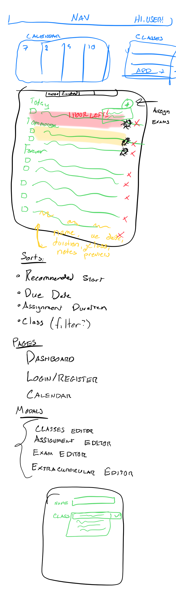
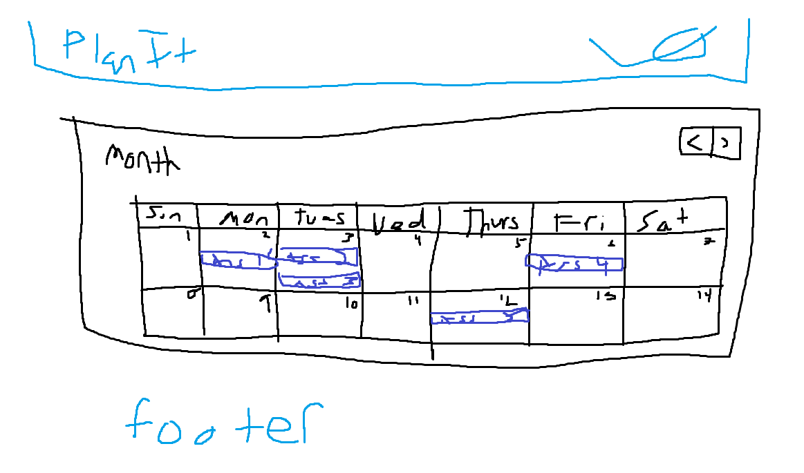
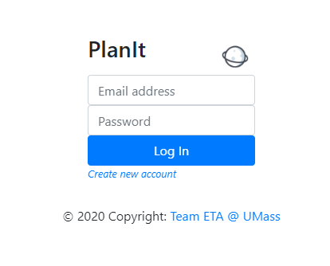
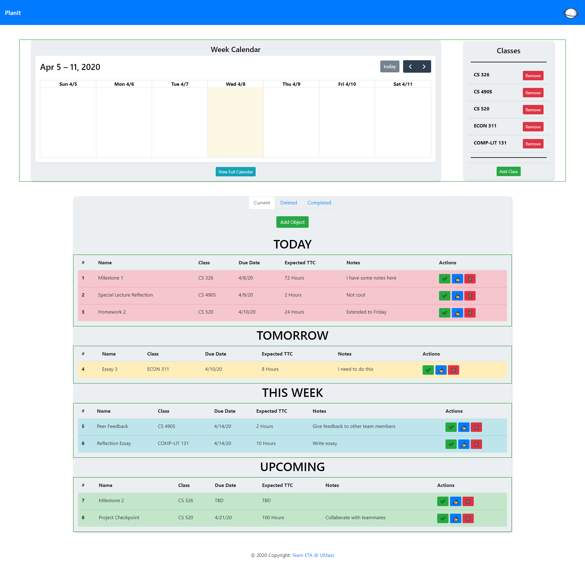
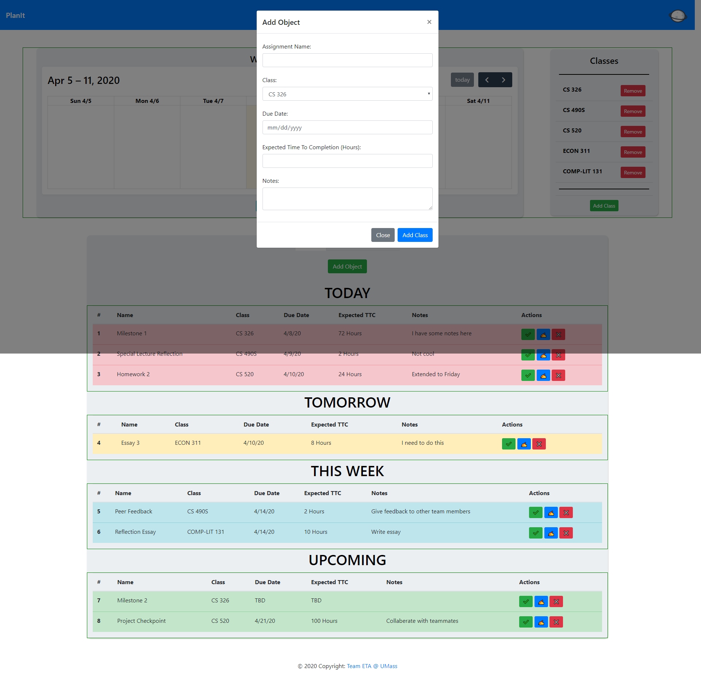
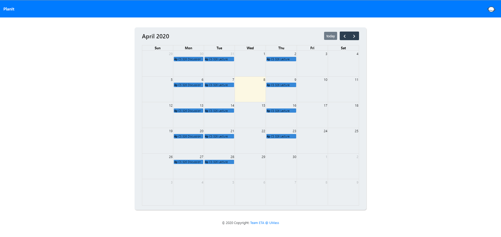

# Team Eta #

## PlanIt ##

### Group Members ###
Kyle Silverman: KSilverman

Devon Endicott: dpendic

Artem Aleksanyan: aaleksanyan

### Innovative Idea ###
A website that helps you manage academic workload by inputing your classes, exam schedule, and assignments. It would give you rundowns on what assignments you need to do today, the the near future, in the distant future, and it would help notify you when you’re in over your head and are about to procrastinate too much. It does this via a job scheduling algorithm.

### Important Components ###
Users will be faced with a login page when they first arrive to the page. After they input their username and password, they will be faced with their dashboard.

Each user's dashboard will contain two main components - a feed containing their assignments (possibly with different density views), and a calendar with important events an assignments marked. The assignment section will present the user with the suggested order of assignments, as well as some suggestions on ways to break it up.

This data will be stored in a MongoDB containing five documents:

- user (name, pw - hashed), 
- class (name, location, prof, schedule, office hours), 
- extracurricular (name, location, schedule), 
- assignment (name, class, assign date, due date, expected time to complete, notes), and 
- exam (name, class, start time, notes)

Users will be able to query this MongoDB to look for the specific information they need, but the system will also automatically show things it deems necessary.

The suggested order of items will come from the job allocation algorithm. Its input will be the set of jobs (or in this case, assignments), their due dates, and expected time to complete. This will spit out an ordered list of things to do to minimize lateness. You can then mark assignments "complete" so the algorithm no longer takes them into account. The program will then process things to be done and the time needed to complete and allocate time blocks to each assignment as necessary. It might also take into account if the user would like to take a break from one class to work on another, and give the next most pressing assignment on a given time block.

### Division of Labor ###
Artem: Login Page
Kyle: Dashboard Page
Devon: Calendar Page (also added calendar on dashboard page)

# ScreenShots #

## Wireframes ##

### Login Page ###

### Dashboard Page ### 

### Calendar Page ###

## HTML/CSS ##

### Login Page ###
Per specifications, we needed a login page. So, we are just asking for a username and password. There is also an option to register as well.

### Dashboard Page ### 
The idea of the dashboard is to lay out all the information for the user to see. We have a weekly small-scale calendar to visualize their work for the week. We also have a list of specified classes that the user has enrolled it. Lastly, we have the main board that shows the user which assignments should be worked on in order of best completion. We also have the ability to add/remove classes and to mark assignments as completed, or the user can edit those assignments or remove them entirely. This is done through modals, which can be seen on the following screen shot (the darkened area is the user's visable screen area).

### Calendar Page ###
This calendar page will the show the entirerty of the calendar to the user. That is, they will be able to see what assignments are due when, and they can add events or anything else of the sort to keep their calendar all in one place.

